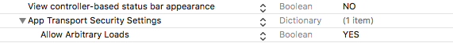

#VISCUIT IOS SDK 적용가이드

목차
=================
* [VISCUIT SDK 구성](#viscuit-sdk-구성)
* [SDK 적용하기](#sdk-적용하기)
	* [1. XCODE 설정](#1-xcode-설정)
		* [1.1 info.plist](#11-infoplist)
		* [1.2 스테이터스바 관련 설정](#12-스테이터스바-관련-설정)
		* [1.3 Project-Build Setting 설정](#13-project-build-setting-설정)
		* [1.4 ViscuitSDK.framework 추가](#14-viscuitsdkframework-추가)
		* [1.5 필수 framework 추가](#15-필수-framework-추가)
    * [2. VISCUIT 사용하기](#2-viscuit-사용하기)
    	* [2.1 헤더 import](#21-헤더-import)
    	* [2.2 VISCUIT 초기화](#22-viscuit-초기화)
    	* [2.3 콜백을 받기 위한 리스너 등록 및 광고 호출](#23-콜백을-받기-위한-리스너-등록-및-광고-호출)
    	* [2.4 광고 호출](#24-광고-호출)
    	* [2.5 광고 존재 여부 확인](#25-광고-존재-여부-확인)
    * [3. Merge Framework적용](#3-merge-framework적용)

---

## VISCUIT SDK 구성
- framework/merge/viscuit_framework (32bit / 64bit merge된 framework)

	> lipo -info merge/viscuitSDK.framework/viscuitSDK
Architectures in the fat file: viscuitSDK.framework/viscuitSDK are: <font color="red">x86_64 i386 armv7 armv7s arm64</font>

- framework/iphoneos/viscuit_framework (64bit)

	> lipo -info iphonesimulator/viscuitSDK.framework/viscuitSDK
Architectures in the fat file: viscuitSDK.framework/viscuitSDK are: <font color="red">i386 x86_64</font>

- framework/iphonesimulator/viscuit_framework (32bit)

	> lipo -info iphoneos/viscuitSDK.framework/viscuitSDK
Architectures in the fat file: viscuitSDK.framework/viscuitSDK are: <font color="red">armv7 arm64</font>

- sample (샘플 프로젝트)

> merge framework를 이용하실 경우에는 [Merge Framework적용](#3-merge-framework적용)을 확인해 주세요.


## SDK 적용하기

###  1. XCODE 설정
#### 1.1 info.plist
>  iOS 9.0이상 에서 http를 웹뷰에서 사용하게 하기 위해서 아래 설정을 info.plist에 추가합니다.
'App Transport Security Settings'
'Allow Arbitary Loads'

#### 1.2 스테이터스바 관련 설정
> 비스킷 영상은 전체 화면으로 플레이 됩니다. info.plist에 아래 항목을 추가해 주세요.
'View controller-based status bar appearance' 'NO'




####  1.3 Project-Build Setting 설정
> 'Project - Build Settings'에서 'Allow Non-modular Includes in Framework Modules' 값을 YES로 설정합니다.


##### 1.4 ViscuitSDK.framework 추가
> 'Project-General'에서 'Embedded Binaries'에 viscuitSDK.framework를 추가한다. 정상적으로 추가 되었을 경우, 아래와 같이 추가 됩니다.


##### 1.5 필수 framework 추가
> LinkedFrameworksandLibraries에 아래 항목들을 추가 합니다.
- AVFoundation.framework
- AVKit.framework
- CoreTelephony.framework
- AdSupport.framework
- libsqlite3.tbd
- SystemConfiguration.framework


### 2. VISCUIT 사용하기

#### 2.1 헤더 import
```objectivec
#import <viscuitSDK/ViscuitSDK.h>
```

#### 2.2 VISCUIT 초기화
현재 슬롯 상태를 초기화 한다. Init시 광고 정보를 가져와서 영상 정보를 저장합니다.
슬롯 아이디를 변경할 이유가 없다면 AppDelegate.m에서 최초 1번 설정하는것이 좋습니다.
```objectivec
- (BOOL)application:(UIApplication *)application didFinishLaunchingWithOptions:(NSDictionary *)launchOptions {
    // Override point for customization after application launch.
    [ViscuitSDK init:@"viscuit" slotCode:@"test_ads"];
    //개발, 상용 환경 설정 ( true : 개발 / false : 상용 )
    //실제 적용시에는 설정하지 않으시면 됩니다. NO로 설정하시면 됩니다.
    [ViscuitSDK setDevType:YES];
    return YES;
}

```


#### 2.3 콜백을 받기 위한 리스너 등록 및 광고 호출
리워드 지급 목적으로 제공되는 Callback입니다.
사용자가 동영상 광고 시청에 대한 CallBack을 제공합니다.
ViewController에 ViscuitDelegate를 등록합니다.
```objectivec
@interface ViewController : UIViewController<ViscuitDelegate>
```
Delegate 등록
```objectivec
[ViscuitSDK delegate:self];
```

Callback 메소드 구현
```objectivec
/*
 Callback Message Type
 Success : 광고 시청 완료 (리워드 지급 조건) Skip : 광고 시청중 Skip 클릭
 Noad : 광고 없음
 Error : SDK 사용 Error
 */
//Callback 함수 작성
- (void) viscuitCallBack:(enum ViscuitResult) v_result {
    switch (v_result) {
        case SUCCESS:
            NSLog(@"Viscuit 광고 정상 시청 완료");
            [self.view makeToast:@"SUCCESS"];
            break;
        case NOAD:
            NSLog(@"Viscuit 가용 광고 없음");
            [self.view makeToast:@"NOAD"];
            break;
        case ERROR:
            NSLog(@"네트워크 에러 등 정상적이지 않은 경우");
            [self.view makeToast:@"ERROR"];
            break;
        case SKIP:
            NSLog(@"Viscuit 광고 스킵");
            [self.view makeToast:@"SKIP"];
            break;
        default:
            break;
    }
}
```

####2.4 광고 호출
동영상 광고를 노출 합니다.
이때 재생할 영상이 없다면 CallBack으로 NoAd가 전달 됩니다.
```objectivec
//광고 재생
[ViscuitSDK viscuitShow:self];
```


####2.5 광고 존재 여부 확인
현재 시청 가능한 광고에 존재 여부를 확인한다. CallBack의 CHECK_NOAD, CHECK_ADREADY 이벤트가 발생한다.

```objectivec
//광고 체크
[ViscuitSDK checkAdStatus];
```


###3. Merge Framework적용
> viscuitSDK는 현재 pods으로 배포 되어 있지 않습니다. 따라서 가상머신으로 개발을 할때 가상머신용(32bit)과 배포용(64bit) 프래임워크를 상황에 맞게 import 해서 빌드 하여야 합니다.
 이 부분을 개선한 방법이 두가지 버전을 합친 merge framework입니다. 32bit/64bit 합쳐진 framework의 경우 App Store에 배포 할때 에러가 발생하게 됩니다. 따라서 아래 스크립트를 이용해서 빌드시에 필요한 framework만 빌드하도록 합니다.

- Target -> Build Phases -> Run Script를 추가합니다.

- Run Script 부분에 아래 스크립트를 추가합니다.

```javascript
APP_PATH="${TARGET_BUILD_DIR}/${WRAPPER_NAME}"

# This script loops through the frameworks embedded in the application and
# removes unused architectures.
# find "$APP_PATH" -name '*.framework' -type d | while read -r FRAMEWORK
find "$APP_PATH" -name 'viscuitSDK.framework' -type d | while read -r FRAMEWORK
do
FRAMEWORK_EXECUTABLE_NAME=$(defaults read "$FRAMEWORK/Info.plist" CFBundleExecutable)
FRAMEWORK_EXECUTABLE_PATH="$FRAMEWORK/$FRAMEWORK_EXECUTABLE_NAME"
echo "Executable is $FRAMEWORK_EXECUTABLE_PATH"

EXTRACTED_ARCHS=()

for ARCH in $ARCHS
do
echo "Extracting $ARCH from $FRAMEWORK_EXECUTABLE_NAME"
lipo -extract "$ARCH" "$FRAMEWORK_EXECUTABLE_PATH" -o "$FRAMEWORK_EXECUTABLE_PATH-$ARCH"
EXTRACTED_ARCHS+=("$FRAMEWORK_EXECUTABLE_PATH-$ARCH")
done

echo "Merging extracted architectures: ${ARCHS}"
lipo -o "$FRAMEWORK_EXECUTABLE_PATH-merged" -create "${EXTRACTED_ARCHS[@]}"
rm "${EXTRACTED_ARCHS[@]}"

echo "Replacing original executable with thinned version"
rm "$FRAMEWORK_EXECUTABLE_PATH"
mv "$FRAMEWORK_EXECUTABLE_PATH-merged" "$FRAMEWORK_EXECUTABLE_PATH"

done
```
